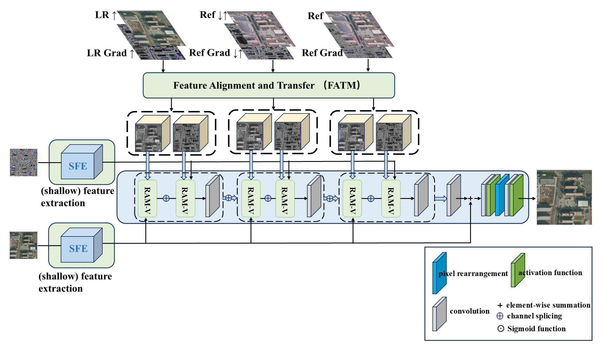
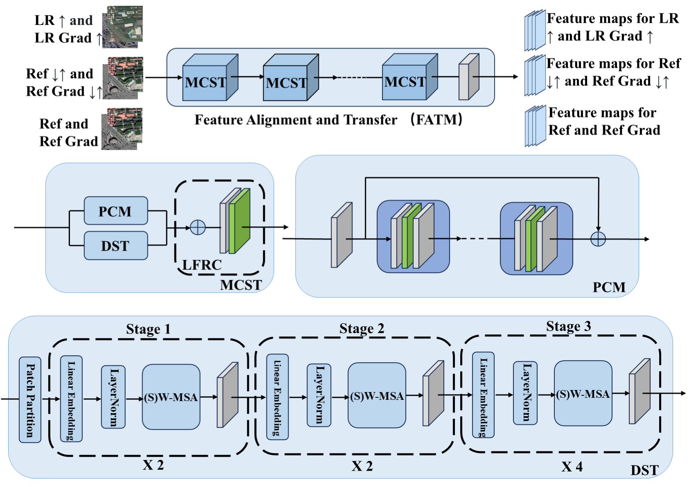

# STGAN: Super-resolution reconstruction of remote sensing images
We propose STGAN, which utilises dual channels of Swin Transformer and CNN to achieve supersegmental reconstruction.

 1.The overall workflow of STGAN is as follows:

2.The generator network structure of STGAN is as follows:

This paper is under submission. We will release the code after paper acceptance. 

If you have any question, please feel free to contact the author by 3111314916@qq.com.